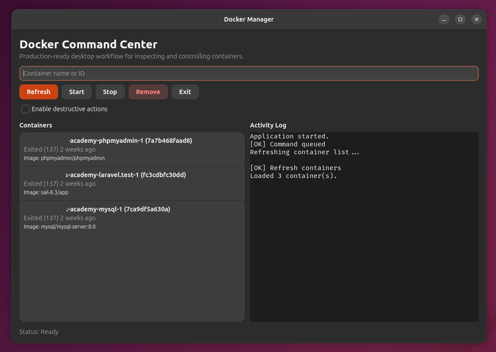

# Docker Manager

**The clean desktop cockpit for Docker.**

Docker Manager is a fast, native Linux desktop app for developers who want Docker control without terminal noise.  
Built with Rust + GTK4, it gives you a focused UI to inspect containers, run actions confidently, and keep full command visibility.

## Why Docker Manager

- Run `Start`, `Stop`, `Remove`, and `Refresh` in one click.
- View live container inventory with name, ID, status, and image.
- Stay responsive under load with non-blocking background execution.
- Track every operation in a clear, in-app activity log.
- Prevent mistakes with a destructive-action safety toggle.
- Keep your workflow local, lightweight, and keyboard-friendly.

## Product Highlights

- Native desktop performance.
- Practical operational safeguards.
- Immediate feedback on success and failure.
- Automatic list refresh after state-changing actions.
- Minimal, focused interface designed for daily use.

## Quick Start

### 1. Prerequisites

- Linux desktop environment
- Docker CLI on your `PATH`
- Permission to run Docker commands
- Rust (stable)

### 2. Run

```bash
cargo run
```

### 3. Build Release

```bash
cargo build --release
```

### 4. Run Tests

```bash
cargo test
```

## Suggested Screenshot Block

Add screenshots to increase conversion when this is published:

- `assets/screenshot-main.png` (full app view)
- `assets/screenshot-actions.png` (start/stop/remove flow)
- `assets/screenshot-log.png` (error/success logging)

Then include:

```md

```

## Architecture

- `src/main.rs`: app bootstrap
- `src/ui.rs`: interface + action orchestration
- `src/docker.rs`: Docker command client + output parsing
- `src/model.rs`: domain models

## Positioning

Docker Manager is ideal for:

- Developers who use Docker every day
- Teams that want safer container operations
- Engineers who prefer native tools over heavy dashboards

## Roadmap

- Container logs viewer
- Restart action
- Search and filters
- Package distribution (`.deb` / Flatpak)

## License

MIT (recommended to add `LICENSE` file if not already present)
